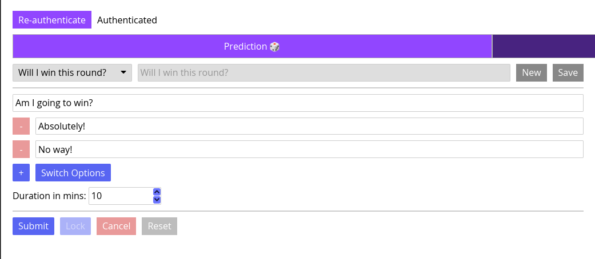
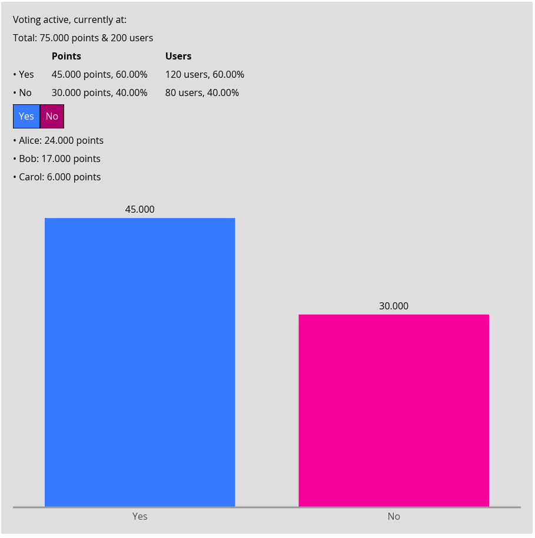
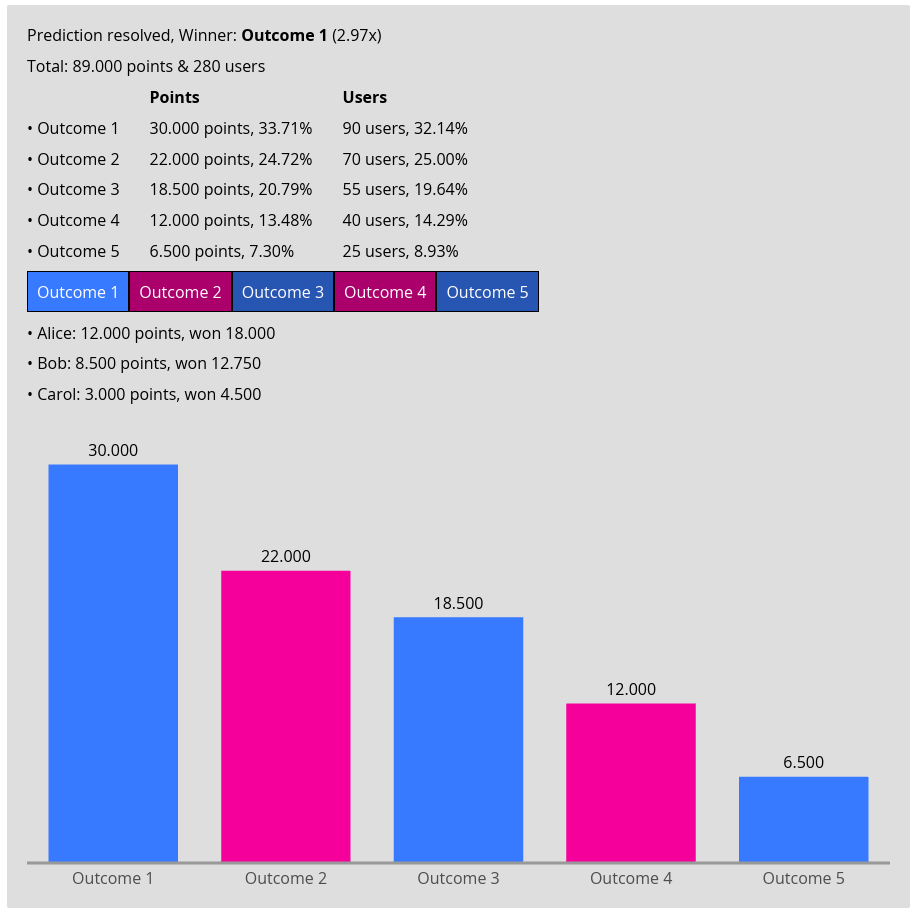
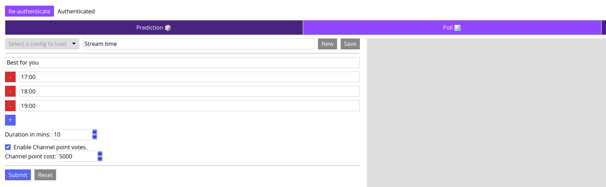
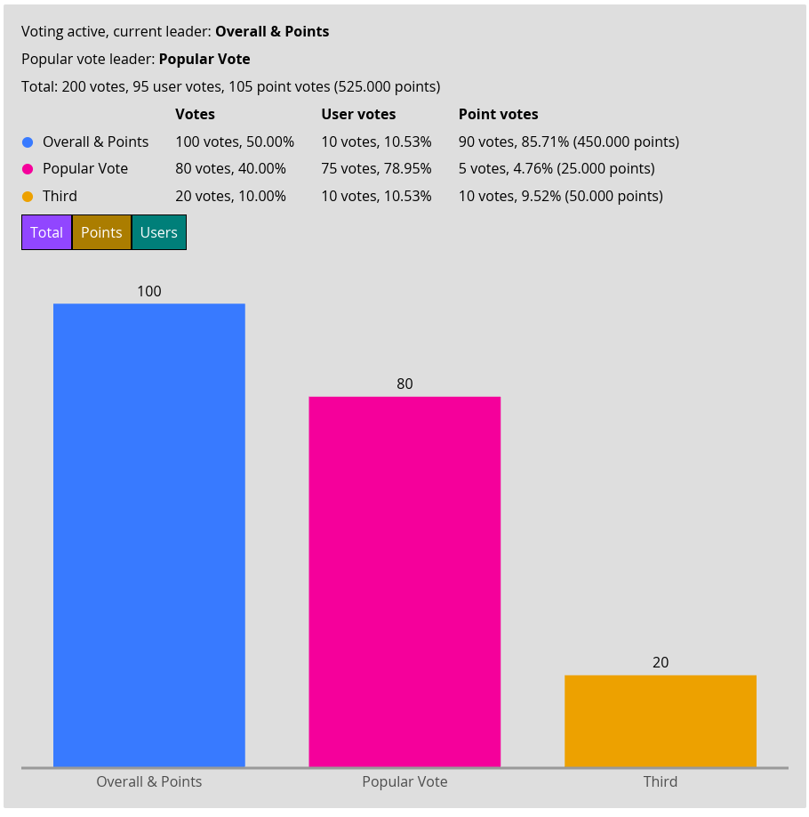
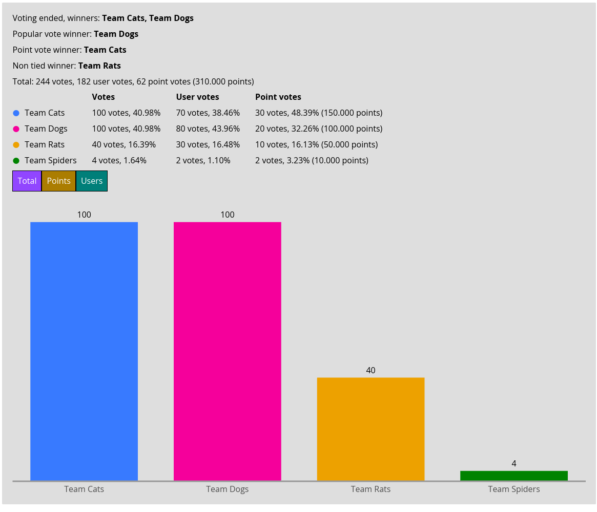

# Twitch Streamertools

A little desktop app meant to provide some Twitch Streamer Management functionality.
The main repository is at [Codeberg](https://codeberg.org/gearboros/streamertools), it is mirrored
to [GitHub](https://github.com/gearboros/streamertools).

## Motivation

I wanted to make an iced desktop app to test the framework for a while. So all I needed was a use case.

For the use case, Twitch Streamer [DDRJake](https://twitch.tv/ddrjake) complained a few times how you were not able to
prepare Twitch polls. So I thought I'd make a little tool that lets Streamers not only prepare polls, but also save
templates and quickly reuse them. The rest is feature creep.

## Current State

This is an early release, I tested it with example polls / predictions, but only with two accounts. It has not been used
on "real" big polls/predictions.

## Features

* Creating and managing polls and predictions
* Keep saved configs of both polls and predictions for easy reuse / templating
* Poll result display:
    * Winner/Leader (including ties and best non-tied winner)
    * Winner by points/user votes if not the same as total winner
    * Points/User votes for all options
    * Bar charts for total votes, point votes and user votes
    * Sadly no "top voters" list akin to top predictors, because Twitch API doesn't give you the information, you can
      vote for
      it [here](https://twitch.uservoice.com/forums/310213-developers/suggestions/51471106-top-point-voters-as-part-of-poll-result)
* Prediction result display
    * Points bet
    * Winner plus payout ratio
    * Top Predictors for each option
    * Bar chart for points bet
* Saves Twitch tokens to OS's Keyring, can save to file fallback if necessary.

## Keyboard shortcuts

Ctrl + 1/2/3 selects the tabs

## Potential Future improvements

* Styling is very barebones, no dark mode exists
* More testing
* Actual features for the misc tab
* As mentioned above, I'd like to add top voters for polls

## Screenshots

## AI Usage Disclaimer

In case you care about this sort of thing, the code in this repo is mostly organic code handwritten by a free-range
software developer. LLMs have been used while coding, but it's not vibe coded or human-supervised-agentic-coded or
whatever fancy terms we have these days.

## Never asked but potentially upcoming questions

### Why didn't you just use twitch_oauth2.rs and/or twitch_api.rs

Good question! I do not have a good answer. Well partially.
For Twitch_api.rs I genuinely wanted to write my own handler for the Twitch api calls. Why? Why not!
As for twitch_oauth2.rs ... I honestly don't know. I started this repo several months ago, got the auth working and then
forgot about it for several months. I am pretty sure I was aware of twitch_oauth2, but for why I didn't just use it, I
cannot say. It probably would have been the better choice.

## Bug reports / Feature requests

This is a small hobby project, I can't promise fast response times, but in case you have an issue or a neat feature
request you can:

* Open an issue
* PM me on Discord (legendarymarvin)
* DM me on Libera IRC (Legendarymarvin)